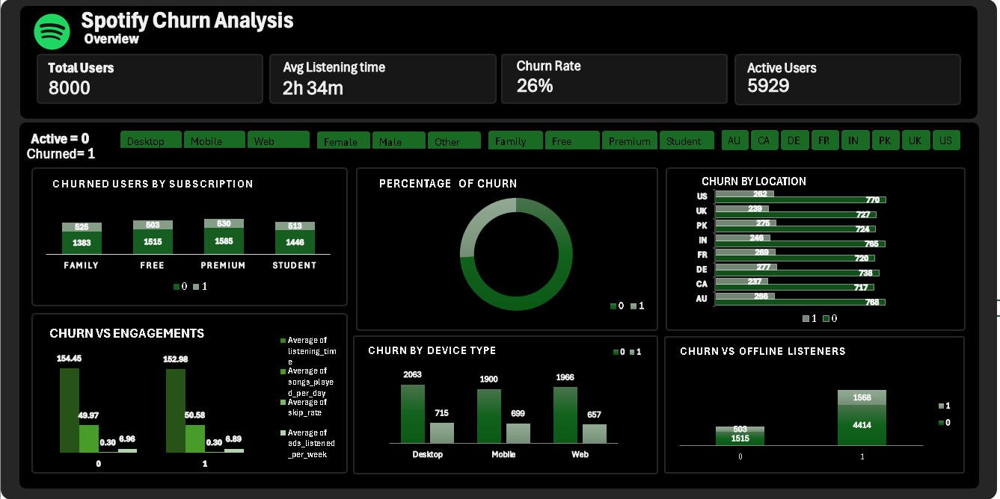

# Spotify Churn Dataset Analysis  

##  Overview  
This project explores the **Spotify Churn dataset**, focusing on understanding user behavior and predicting churn. Churn refers to users who stop using a service within a specific period. By analyzing the dataset, we can identify key patterns and factors influencing churn, which is critical for customer retention strategies.  

##  Dataset  
- **Source:** [Public Spotify churn dataset (sample dataset for learning purposes).](https://www.kaggle.com/datasets/nabihazahid/spotify-dataset-for-churn-analysis)  
- **Key Features:**
  - `user_id` – Unique identifier for each user  
  - `age` – Age of the user 
  - `country` - where the user is listening from 
  - `gender` – Gender of the user  
  - `subscription_type` – Free, family, premium or student plan  
  - `song_played_per_day` – Number of days user engaged with the platform  
  - `listening_time` – Total minutes streamed  
  - `skip_rate` - how many users are skipping songs
  - `device_type` - the kind of device they use
  - `ads_listened` – Number of ads the user listened to  
  - `offline_listening` - How many songs they listen to offine
  - `is_churned` – Target variable (1 = churned, 0 = active)  

## 🔎 Objectives  
- Analyze user activity patterns (listening time, ads exposure, subscription types).  
- Visualize churn trends across demographics and usage behaviors.  
- average
- Build insights that can guide retention strategies.  

## Tools Used  
- **Excel** – Data cleaning and summary analysis
- pivot tables  
- Pivot Charts  
- Slicers & Filters  
- Dashboard Formatting
   

##  Files in Repository
- `spotify_churn_dataset raw data` -> the raw uncleaned file
- `spotify_pivots_dash.xlsx` → Cleaned dataset with pivot tables and dashboard  
- `README.md` → Project documentation  
- `spotify_dashboard.png` → Screenshot of the dashboard  

 

## 📈 Key Insights (Example)  
- Paid users have lower churn rates compared to free users.  
- Heavy listeners with higher play time churn less frequently.  
- Younger age groups tend to churn more often.  

##  Dashboard Preview
--- 
